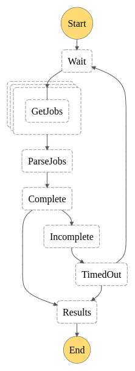

# firefly

Demo SAM App

## State Machines

### Batch Job Monitor
Monitors the completion status of one or more external Jobs. The status of
each job is returned when all jobs are considered "complete" or the batch times out.



#### DynamoDB
The service DynamoDB table must contain the target Batch record and one or more related Job records.
The naming convention is not important, but each record must be uniquely identified with a `pk` & `sk` keys (partition & sort keys).

##### Recomended Naming Convention
| entity  | pk  | sk |
| ------------- | ------------- |
| Batch  | BATCH#1234 | BATCH#1234 |
| Job | BATCH#1234 | JOB#3333 |
| Job | BATCH#1234 | JOB#4444 |

#### Input Example

| Property  | Value |
| ------------- | ------------- |
| pk  | Partition Key of the parent Batch |
| Id  | Array of Jobs (Partition & Sort keys) |
| intervalSeconds  | Seconds to wait between completion checks |
| maxAttempts  | Number of times to check before timing out |

```json
{
  "batch": {
    "pk": "BATCH#1234",
    "jobs": [
      { "pk": "BATCH#1234", "sk": "JOB#5555" },
      { "pk": "BATCH#1234", "sk": "JOB#6666" }
    ],
    "intervalSeconds": "60",
    "maxAttempts": "10"
  }
}
```

#### Results Example

| Property  | Value |
| ------------- | ------------- |
| DynamoDB  | Results for all jobs from DynamoDB |
| results  | Aggregated job results |

```json
{
  "intervalSeconds": "60",
  "maxAttempts": "10",
  "DynamoDB": [
    {
      "Item": { 
        "stat": { "S": "COMPLETE" },
        "pk": { "S": "BATCH#1234" },
        "sk": { "S": "JOB#5555" },
      }
    },
    {
      "Item": { 
        "stat": { "S": "SUBMITTED" },
        "pk": { "S": "BATCH#1234" },
        "sk": { "S": "JOB#6666" },
      }
    },
  ],
  "results": {
    "Payload": {
      "completed": false,
      "complete": 1,
      "total": 2
    }
  }
}
```