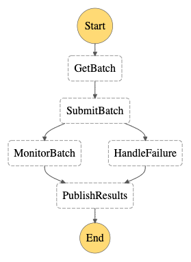

# firefly

Demo SAM App

## High Level Flow
1. An external state machine submits a batch job to the service by sending the JSON batch
details to the service SQS queue using the `waitForTaskToken` type.

2. The service consume the message in the SQS queue, validates and persists it in DDB.

3. The service monitors the number of jobs submitted to the external service and submits all
waiting batches when the external service has available job capacity.

4. Submitted batches are monitored until all related jobs are updated in DDB as "COMPLETE" or
the batch as timed out.

5. Batch results are evaluated and the external parent state machine is notified of the results via
the `SendTaskSuccess` or `SendTaskFailure` AWS SDK methods.

## State Machines
### Batch Manager
A State Machine that manages the lifecycle of batch jobs.

1. `GetBatch` - pulls all batch & job records from DDB (integration or handle in SubmitBatch?)
2. `SubmitBatch` - submits all jobs to external service
3a. `MonitorBatch` - starts nested `Batch Monitor` State Machine
3b. `HandleFailure` - submittal failures are handled here, if any
4. `PublishResults` - evaluate batch results & notify originating State Machine (pass or fail)



### Batch Monitor
A State Machine that can be nested within parent State Machines or used independently.
Monitors the completion status of one or more external Jobs. The status of each job is returned when all jobs are considered "complete" or the batch times out.


#### DynamoDB
The service DynamoDB table must contain the target Batch record and one or more related Job records.
The naming convention is not important, but each record must be uniquely identified with `pk` & `sk` keys (partition & sort keys).
A Batch is considered "complete" when the "status" attribute (`GSI1pk`) on **all** Jobs has been updated to `COMPLETE`.

##### Recomended Naming Convention
| entity  | pk  | sk |
| ------------- | ------------- | ------------- |
| Batch  | BATCH#1234 | BATCH#1234 |
| Job | BATCH#1234 | JOB#3333 |
| Job | BATCH#1234 | JOB#4444 |

#### Input Example

| Property  | Value |
| ------------- | ------------- |
| pk  | Partition Key of the parent Batch |
| jobs  | Array of Jobs (Partition & Sort keys) |
| intervalSeconds  | Seconds to wait between completion checks |
| maxAttempts  | Number of times to check before timing out |

```json
{
  "batch": {
    "pk": "BATCH#1234",
    "jobs": [
      { "pk": "BATCH#1234", "sk": "JOB#5555" },
      { "pk": "BATCH#1234", "sk": "JOB#6666" }
    ],
    "intervalSeconds": "60",
    "maxAttempts": "10"
  }
}
```

#### Results Example

| Property  | Value |
| ------------- | ------------- |
| DynamoDB  | Results for all jobs from DynamoDB |
| results  | Aggregated job results |

```json
{
  "intervalSeconds": "60",
  "maxAttempts": "10",
  "DynamoDB": [
    {
      "Item": { 
        "GSI1pk": { "S": "COMPLETE" },
        "pk": { "S": "BATCH#1234" },
        "sk": { "S": "JOB#5555" },
      }
    },
    {
      "Item": { 
        "GSI1pk": { "S": "SUBMITTED" },
        "pk": { "S": "BATCH#1234" },
        "sk": { "S": "JOB#6666" },
      }
    },
  ],
  "results": {
    "Payload": {
      "completed": false,
      "complete": 1,
      "total": 2
    }
  }
}
```

## Lambda Functions (Node.js 12.x)
### BatchConsumer
Consumes new batch messages from the `BatchQueue`. Messages are validated and posted to the 
service `EntityTable` as `Batch` & `Job` entities. Messages that error are retried and sent to the `BatchDLQ` via **Lambda Destinations** if all retries fail.

### BatchManager
A **scheduled** function that queries the service `EntityTable` to determine how many jobs are currently
in progress (submitted but not complete). If number of jobs in progress is less than the maximum allowed, the waiting batch is pulled (oldest), processed and passed to the `Batch Manager` state machine. The process is repeated until the number of jobs allowed limit is reached or there 0 jobs waiting. This function is restricted to `1` concurrent execution. 

### BatchSubmit
A function that is invoked by the `Batch Manager` state machine when a new batch is ready to be submitted.
Jobs are submitted and retried up to the defined retry limit. Appropriate success/fail state is returned to
the state machine.

### BatchResults
A function that is invoked by the `Batch Manager` state machine when the batch results are received.
The results are evaluated and the originating state machine is notified of the results (success or failure) via 
waitForTaskToken methods. Appropriate EventBridge messages are sent and the associated records are removed from
the Entity table.

## DynamoDB
### EntityTable
A table to persist **all** service data (single table design).
The following keys are mandatory. Duplicate pk & sk to GSI1pk & GSI1sk respectively if your entity does not
utilize a GSI (Global Secondary Index).

| key  | type  |
| ------------- | ------------- |
| pk  | partition key |
| sk  | sort key |
| GSI1pk  | GSI partition key |
| GSI1sk  | GSI sort key |

## SQS
### BatchQueue
Receives new batch jobs.

### BatchDLQ
Dead letter queue for batches that could not be processed.

## EventBridge
An EventBridge to handle all messages for this service and other related services.

### AllEventsRule
Receives **all** messages publised to the event bus and logs them in the `EventsLogGroup`
CloudWatch log group.

## SSM Paramters
* /firefly/sqs/batch-queue-url
* /firefly/events/event-bus-name